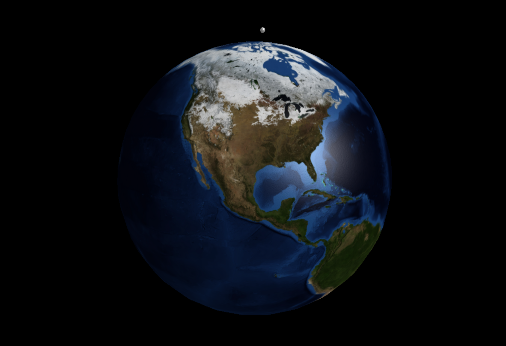
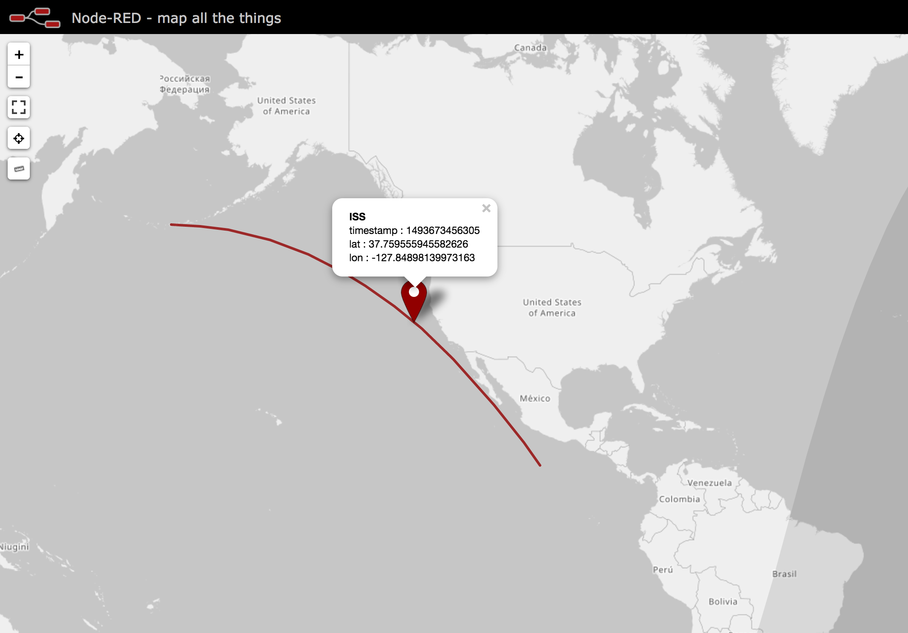

node-red-contrib-satellites (v0.0.4)
=============================

A set of <a href="http://nodered.org" target="_new">Node-RED</a> nodes to help working with Two-Line-Element (TLE) sets. Utilising the <a href="https://github.com/shashwatak/satellite-js">satellites.js</a> library to convert the TLE sets into <i>xyz</i> and <i>latlng</i> coordinates.

### Examples 
In the `./examples` folder you can find sample flows that demonstrate some use cases for this set of nodes.

#### `./examples/ISS.json`

This flow will calculate the current *xyz* position of the ISS, using the relevant TLE data in the `satellite` node. The data is then fed into the `earth` node for visualisation.

#### `./examples/ISS-worldmap.json`

***note***: *This example has a dependancy on the `node-red-contrib-web-worldmap` node.* 

This flow will calculate the current position of the ISS, using it's TLE data in the `satellite` node, and convert it into latitude and longitude coordinates for input into the `worldmap` node.

The `time array` node is used to calculate the timestamps for +/- 10 minutes from the current time, as to create the recent and upcoming path of the ISS. The use of the `latlng` node and a `function` node converts the data into the right format for the `worldmap` node to render the route as a line.
