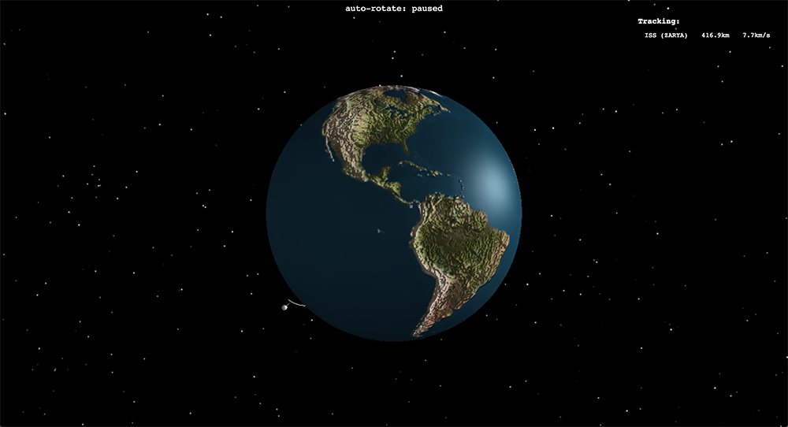
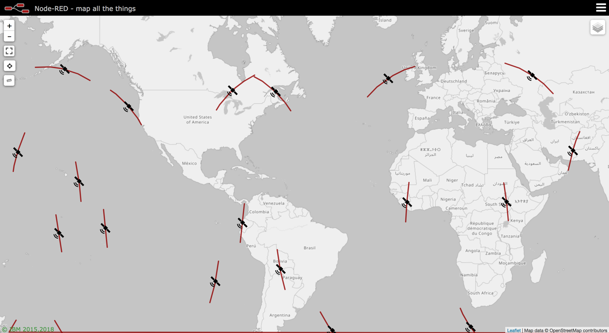

node-red-contrib-satellites (v0.3.0)
====================================

A set of <a href="http://nodered.org" target="new">Node-RED</a> nodes to help working with Two-Line-Element (TLE) sets. Utilising the <a href="https://github.com/shashwatak/satellite-js">satellites.js</a> library to convert the TLE sets into <i>xyz</i> and <i>latlng</i> coordinates.

The list of satellites, and associated TLE data is retrieved from [NORAD](https://www.celestrak.com/NORAD/elements/).

## Changelog

v0.3.0
  - New 3d rendering using lat,lon,alt - that is much more accurate. Also includes sun in correct relative position, ability to ride along with the chosen satellite, and pause/resume gentle rotation. Updated examples.

v0.2.0
  - New "TLE" node which is the equivalent of the old "Satellite" node, allowing you to input raw TLE data.
  - Modified "Satellite" node which now provides you with a predefined selection of types and satellites.
  - Added new "GPS Constellation" example & updated old "ISS worldmap.json" example.

### Examples
In the `./examples` folder you can find sample flows that demonstrate some use cases for this set of nodes. These can be imported to the editor via Menu - Import - Examples - satellite

Please note that TLE Data for a given satellite does change, and so the TLE data set used here may be out of date when you come to use it. For an up to date dataset for the ISS, please go [here](https://www.celestrak.com/NORAD/elements/stations.txt):

#### `./examples/ISS 3d.json`

This flow will calculate the current *xyz* position of the ISS, using the relevant TLE data in the `satellite` node. The data is then fed into the `earth` node for visualisation.

#### `./examples/ISS worldmap.json`

***note***: *This example has a dependancy on the `node-red-contrib-web-worldmap` node.*

This flow will calculate the current position of the ISS, using it's TLE data in the `satellite` node, and convert it into the relevant formats for use with the `worldmap` node.

The `time array` node is used to calculate the timestamps for +/- 10 minutes from the current time, as to create the recent and upcoming path of the ISS.

#### `./examples/GPS constellation.json`

***note***: *This example has a dependancy on the `node-red-contrib-web-worldmap` node.*

This flow will shows the location of GPS satellites (in latitude and longitude) on the worldmap node.

The `time array` node is used to calculate the timestamps for +/- 20 minutes from the current time, as to create the recent and upcoming path of each satellite. The pin is then shown at the 20th point in that array (halfway given the sample rate of 40 points).

### Known Issues

- The 'Earth' node is quite computationally heavy, we're looking into the exact recommendations for the hardware to effectively run this node, in addition to how we can lighten the load on the machine.
- Windows: We are aware of some issues when running these nodes on Windows, and they are being investigated.
